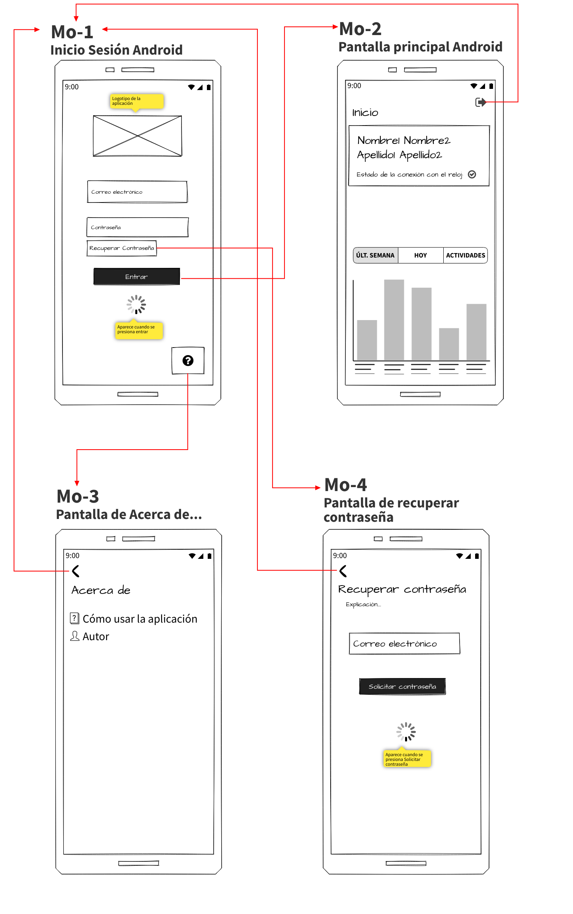
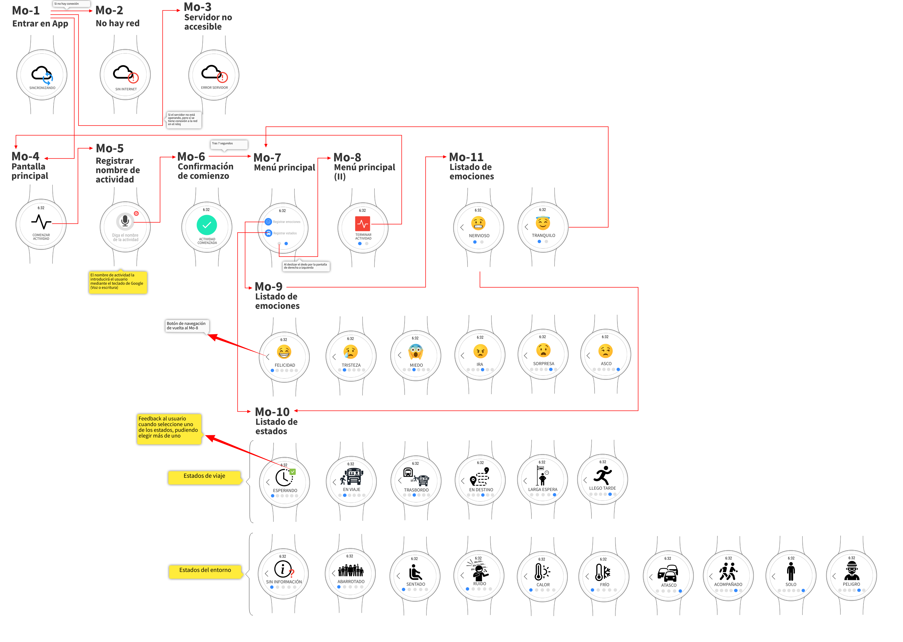
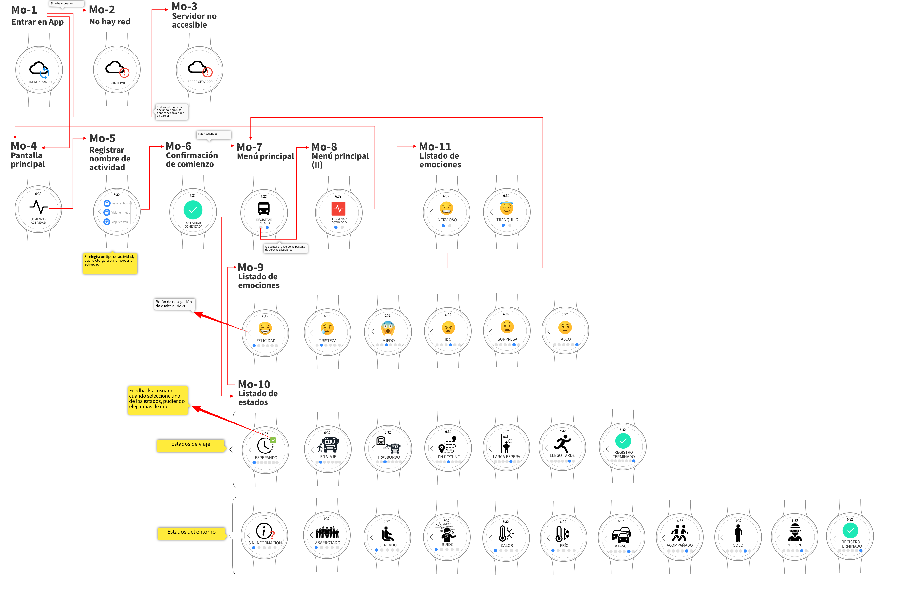

# Wireframes y Mockups

En el presente documento, anotaré los cambios a modo de mockup que vayan surgiendo a lo largo del desarrollo. Comenzaremos el desarrollo con un planteamiento de diseño como el que se muestra a continuación.
## App Android

### Diseño Inicial

### CHANGELOG - 31/03/2022

- Cambio del gráfico en Mo-2 a uno con barras y diferentes opciones.

## App WearOS

### Diseño inicial

### CHANGELOG - 31/03/2022

- Cambio de input de voz para nombre de actividad a una lista de tipos de actividad preestablecida.
- Flujo: Mo-7 -> Mo-10 -> Mo-9 -> Mo-11 -> Mo-7.
- Mo-10 Pantalla final para confirmar la selección.