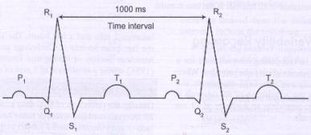

# Listado de sensores extraidos de TicWatch Pro 3

Existen varias medidas que nos pueden convenir usar a la hora de medir el estrés.

Dado una representación esquemática de un intervalo de pulsaciones.



[Enlace](https://www.efdeportes.com/efd121/variabilidad-de-la-frecuencia-cardiaca-una-herramienta-util.htm#:~:text=SDNN%20(ms)%3A%20desviaci%C3%B3n%20est%C3%A1ndar,los%20intervalos%20R%2DR%20(HRV).)

- PPG (Photoplethysmogram) - Fotopletismografía. Illuminates skin and determines blood volume level. Para los usuarios de WearOS lo llamamos un sensor de ritmo cardíaco.

- HRV (Heart Rate Variability) - Variabilidad de frecuencia cardíaca. Variación en el intervalo entre latidos.

- IBI (Inter-Beat Interval) - Intervalo entre latidos . Tiempo entre latidos.

- SDNN - desviación estándar todos los intervalos R-R. Variación entre los IBI.

- RMSSD (root mean square successive difference) - Media cuadrada de las diferencias sucesivas. Otra medida de variación del IBI.

Mediante la ejecución del siguiente código en el reloj, obtenemos su lista de sensores con sus respectivos identificadores.

```kotlin
// kotlin
val sensorList: List<Sensor> = mSensorManager!!.getSensorList(Sensor.TYPE_ALL)
for (currentSensor in sensorList) {
    Log.d(
        "List sensors",
        "Name: " + currentSensor.name + " /Type_String: " + currentSensor.stringType + " /Type_number: " + currentSensor.type
    )
}
```


```

D/List sensors: Name: Accelerometer /Type_String: android.sensor.accelerometer /Type_number: 1
D/List sensors: Name: Gyroscope /Type_String: android.sensor.gyroscope /Type_number: 4
    Name: Magnetometer /Type_String: android.sensor.magnetic_field /Type_number: 2
    Name: Light /Type_String: android.sensor.light /Type_number: 5
D/List sensors: Name: Orientation /Type_String: android.sensor.orientation /Type_number: 3
D/List sensors: Name: Significant Motion /Type_String: android.sensor.significant_motion /Type_number: 17
    Name: Gravity /Type_String: android.sensor.gravity /Type_number: 9
D/List sensors: Name: Linear Acceleration /Type_String: android.sensor.linear_acceleration /Type_number: 10
    Name: Rotation Vector /Type_String: android.sensor.rotation_vector /Type_number: 11
D/List sensors: Name: Geomagnetic Rotation Vector /Type_String: android.sensor.geomagnetic_rotation_vector /Type_number: 20
    Name: Game Rotation Vector /Type_String: android.sensor.game_rotation_vector /Type_number: 15
    Name: Magnetometer (uncalibrated) /Type_String: android.sensor.magnetic_field_uncalibrated /Type_number: 14
D/List sensors: Name: Gyroscope (uncalibrated) /Type_String: android.sensor.gyroscope_uncalibrated /Type_number: 16
D/List sensors: Name: Heart Rate PPG /Type_String: android.sensor.heart_rate /Type_number: 21
D/List sensors: Name: Tilt Detector /Type_String: android.sensor.wrist_tilt_gesture /Type_number: 26
D/List sensors: Name: Activity Recognizer /Type_String: android.sensor.mobvoi_activity_recognizer /Type_number: 69632
    Name: Step Detector /Type_String: android.sensor.step_detector /Type_number: 18
D/List sensors: Name: Step Counter /Type_String: android.sensor.step_counter /Type_number: 19
    Name: Activity Data /Type_String: android.sensor.mobvoi_activity_data /Type_number: 69633
    Name: Off Body Detector /Type_String: android.sensor.low_latency_offbody_detect /Type_number: 34
D/List sensors: Name: Heart Rate PPG Raw Data /Type_String: com.google.wear.sensor.ppg /Type_number: 65572
```
